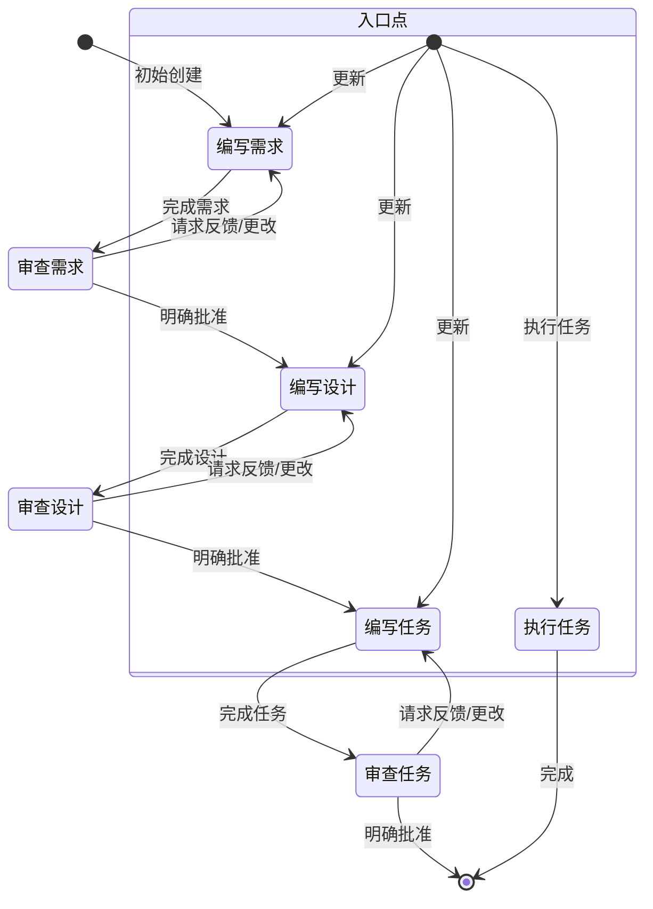
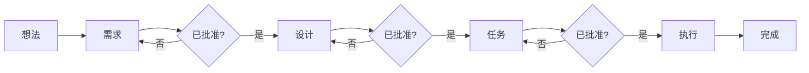
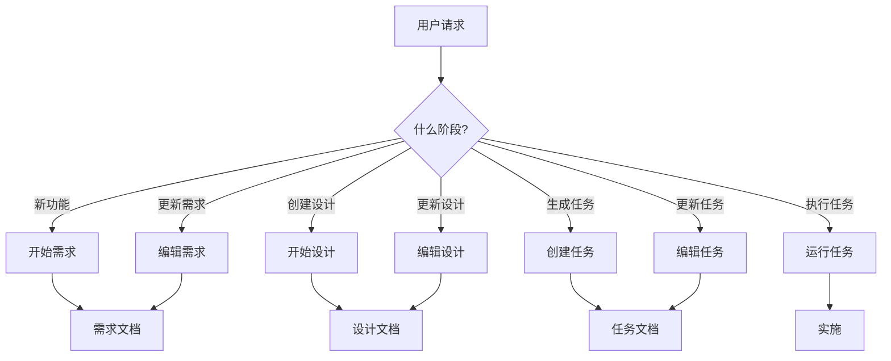
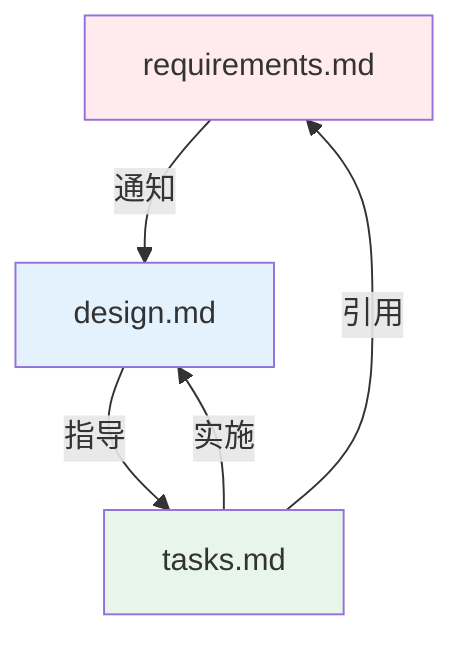
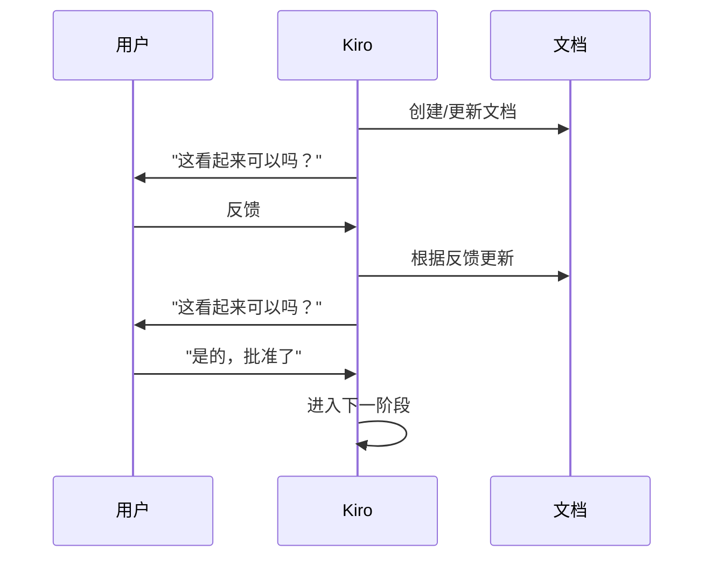
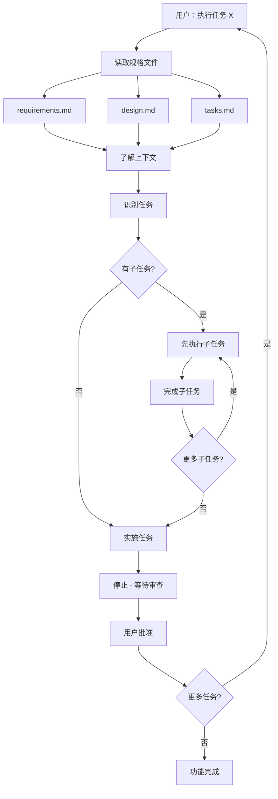

# Kiro 工作流图

## 主工作流状态机

此图显示了从初始创建到任务执行的完整工作流：



## 阶段进度

此简化图显示了通过阶段的线性进度：



## 工作流入口点

用户可以在不同点进入工作流：



## 文件结构

```
.kiro/
└── specs/
    └── {功能名称}/    # 短横线命名
        ├── requirements.md  # 阶段 1
        ├── design.md        # 阶段 2
        └── tasks.md         # 阶段 3
```

## 文档依赖



## 批准关卡

每个阶段都有一个明确的批准关卡：



## 任务执行流程


